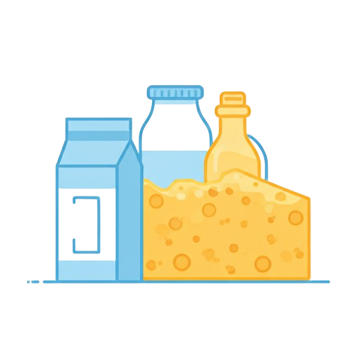
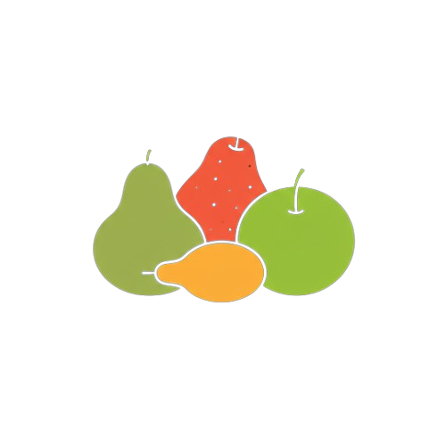
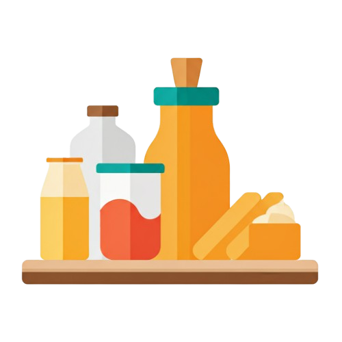
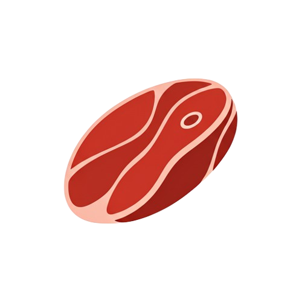
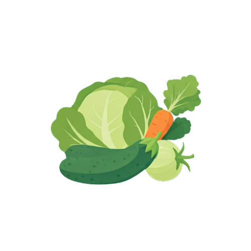

  

<a align="center" href="https://github.com/SuperMeals">
    <h3 align="center">SuperMeals</h3>
</a>
<h4 align="center">Supermeals – A recipe suggestion app with a modern UI. Users can enter ingredients they have, and the app suggests possible recipes to cook.</h4>

 
  
  
  

---

## ✨ Features
- Search recipes by ingredients  
- Beautiful, modern UI  
- Step-by-step instructions  
- Categorized ingredients (dairy, fruits, grains, etc.)  
- Cross-platform (Android & iOS)  

---

## 📸 Categories in App  

  
  
  
  
  
  

---

### Installation

App Avalible Here -> [INSTALL](https://github.com/Raahim2/SuperMeals/releases/download/supermeals/SuperMeals.apk)

